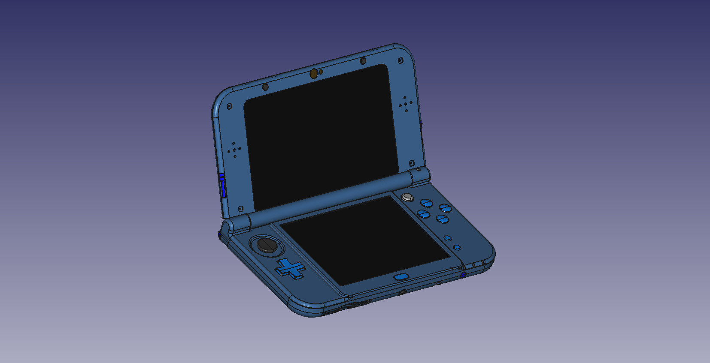

# red-001-housing-shell

CAD data for a housing shell compatible with the RED-001.

This model was created from scratch using measurements and visual estimation. It is not based on any illegally published information.

## Contributing

Contributions are welcome.

The goal of this project is to recreate the housing shell of the original RED-001 as accurately as possible. Therefore, we do not accept proposals for additional features or modifications.

If possible, please consider prototyping your contributions using high-precision manufacturing methods such as SLS (Selective Laser Sintering) before submitting them.

## License

This model is licensed under the [Creative Commons Attribution-ShareAlike 4.0 International License (CC BY-SA 4.0)](https://creativecommons.org/licenses/by-sa/4.0/).

Originally sponsored by Koutaro Mukai &lt;mukai.k1011k[at]outlook.jp&gt; and created by Hayato Ishii &lt;haya1184111[at]gmail.com&gt;. Under contract, all copyrights have been assigned to Koutaro Mukai to the fullest extent permitted by law.
